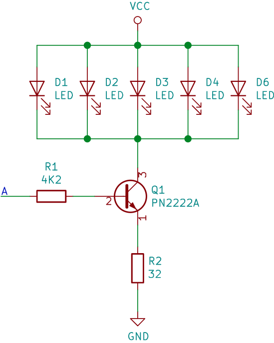

# Calculo de componentes

## Datos

- $\beta =75$
- $V_{CE} = 0.3V$ (Corte-saturación)
- Corriente por led de $10mA$
- Voltaje de led $3V$
- Voltaje de alimentación $Vcc = 5V$
- Consumo de corriente por segmento, $(5Leds)(10mA) = 50mA$

**Ganancia**

$$
\beta = \frac{Ic}{Ib}
$$

**Obteniendo la corriente de base**

$$
I_B = \frac{50mA}{75} = \color{red}{666.66 \mu A}
$$

**Voltaje de base**

$$
V_{BB}= V_B+V_{BE} - V_E
$$

**Voltaje de colector a emisor**

$$
V_{CC}=V_{LED}+V_{CE}+V_E
$$

Obteniendo primero el voltaje de emisor ($V_E$)

$$
V_E=V_{CC}- V_{LED} - V_{CE}= 5V -3V -0.3V = \color{red}{1.7V}
$$

Despejando para obtener la $R_B$

$V_{BB}$ = Voltaje de señal de activación del segmento

$$
R_B = \frac{V_{BB}-V_{BE}-V_E}{I_B}= \frac{5V-0.7V-1.7V}{666.66 \mu A} = \color{red}{3.9k \Omega}
$$

Obteniendo la **resistencia de emisor**

$$
R_E= \frac{1.7V}{50mA}=  \rightarrow \color{red}{34 \Omega}
$$

*Se ocuparon otras valores de resistencia muy cercanos por no contar con los calculados* 

$$
R_B = 4.2 k \Omega
$$

$$
R_E = 32 \Omega
$$